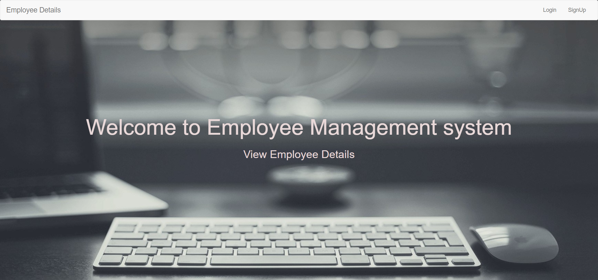
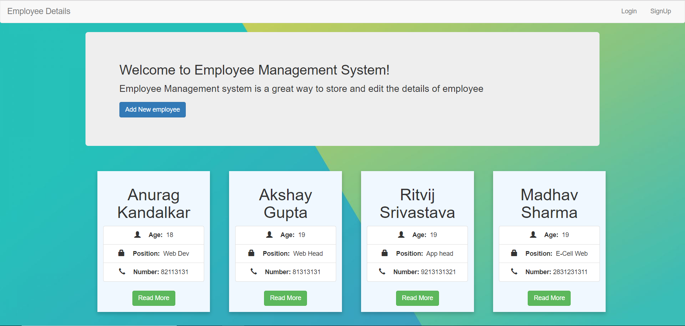
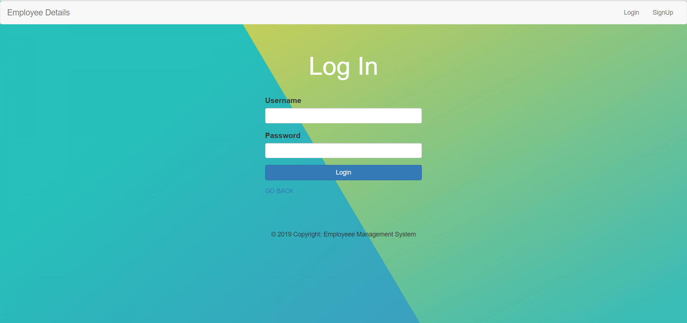
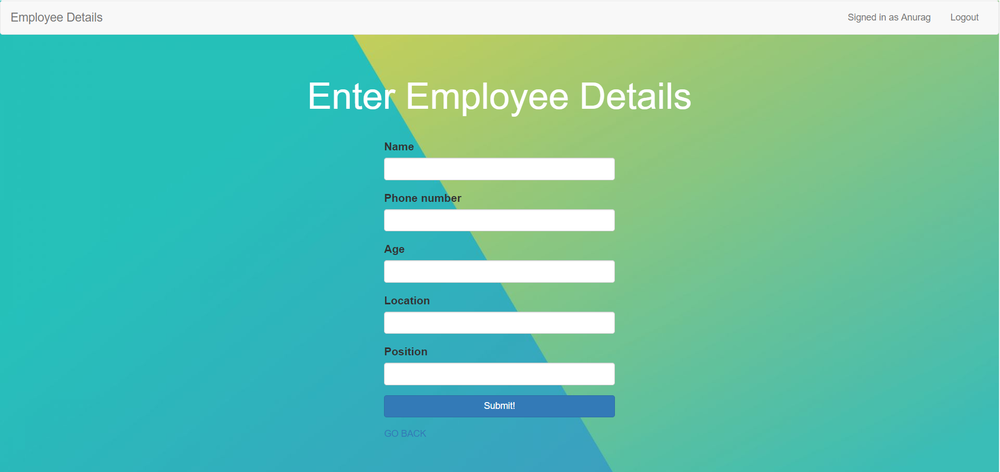
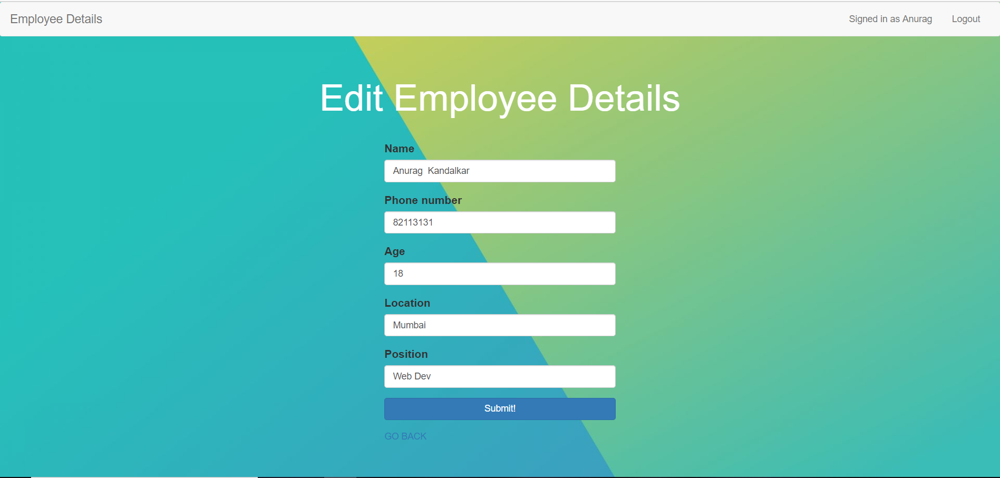

# Employee-Management
This is a website which locally stores the details of Employee and and allows admin to add new and edit Employee Details.
I have used Node.js Mongodb and Express.
Features of Employee-Management:

    1. Login and Sign up functionality to add,edit and delete employee details.While anyone can view the employee details
    2. The user who created the profile can only edit and delete and no one else.
    3. Passport and passport local are used to  take care of login and signup stuff
    4. Tried keeping design minimal for user to easily navigate through Website.
   
## To Run the code
* Clone the Repository
* In console `npm install express`
* In console `node app.js`
* Open browser and enter url `http://localhost:3000/`

   
   
   
### SCREENSHOTS
   

   

   

   

   
   
   
  

   #### Work to be done
   The show.ejs file which displays the particular employee details requires a redesign .Might Update in upcoming days,weeks :)
