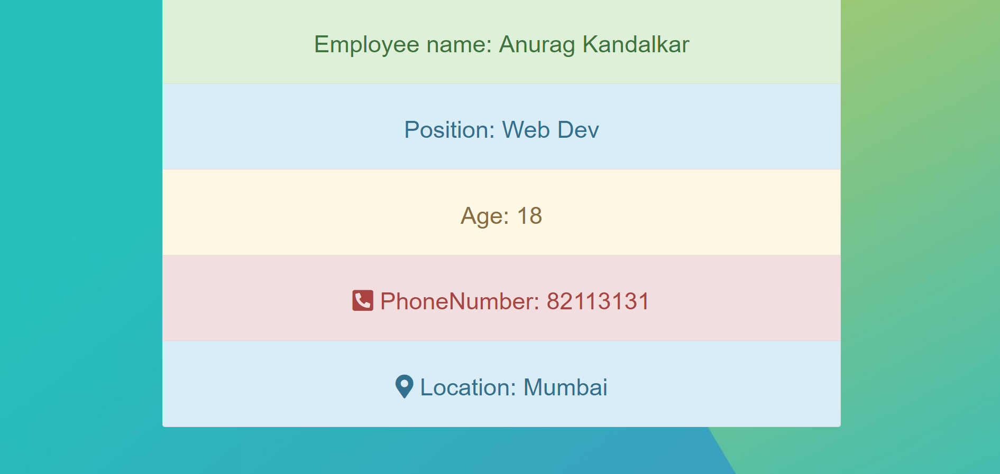
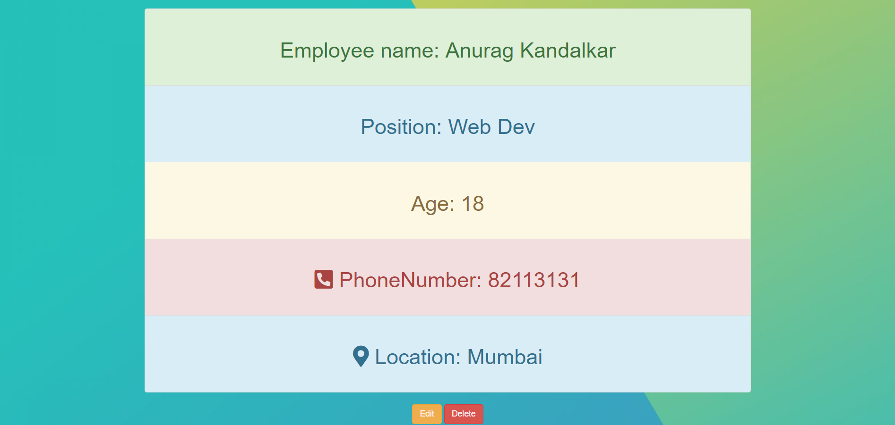

# Employee-Management
This is a website which locally stores the details of Employee and and allows admin to add new and edit Employee Details.
I have used Node.js Mongodb and Express.
## Features of Employee-Management:

    1. Login and Sign up functionality to add,edit and delete employee details.While anyone can view the employee details
    2. The user who created the profile can only edit and delete and no one else.
    3. Passport and passport local are used to  take care of login and signup stuff
    4. Tried keeping design minimal for user to easily navigate through Website.
   
## To Run the code
* Clone the Repository
* In console `npm install express`
* In console `node app.js`
* Open browser and enter url `http://localhost:3000/`

   
   
   
### SCREENSHOTS
* This is Index page 
    
* On clicking `View Employee Details ` or `Employee Details`.
 The below webpage loads which views home page
   
* If User clicks on `Add new Employee` or `Login`
    User is prompted or login page is loaded.
   
* After Logging,you are redirected to home page and instead of `Login` and `Sign up ` it shows `Signed as #Username` and `Logout`
   
* On clicking on  `Add new employee` form which allows user to input data is loaded
     
* On clicking on `Read More` The following page loads up.

   
* If user who created the profile can see the option to `delete` and `edit`
   

*  On clicking `Edit` The details of the that particular employee is displayed.
   Note:The user who added can only edit and delete .No other user can delete or edit.
   
  

    #### //=== Work to be done ===//
    The show.ejs file which displays the particular employee details requires a redesign .Might Update in upcoming days,weeks :)
